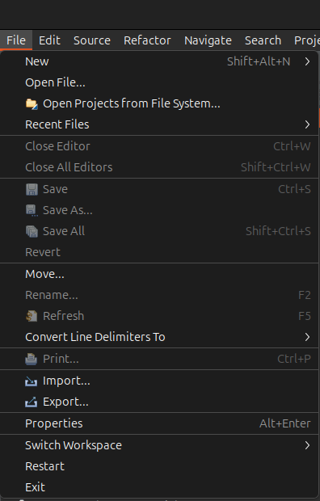
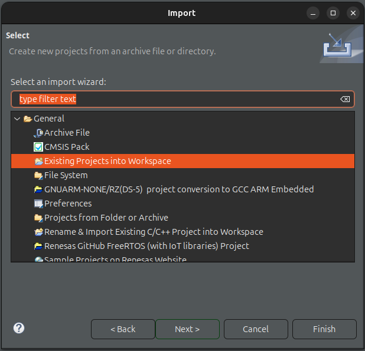
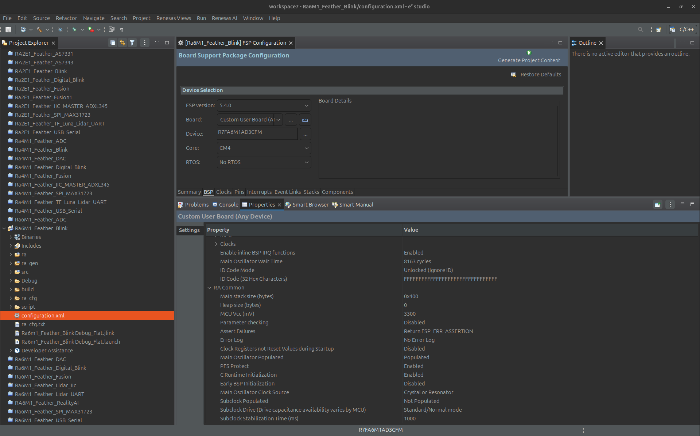
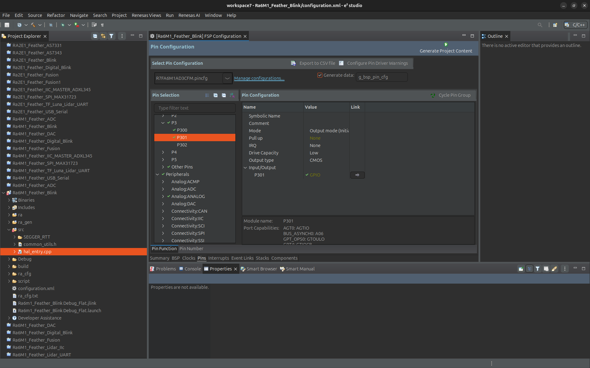
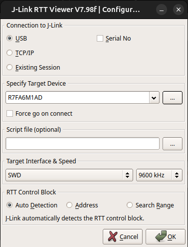

# Zalmotek RA6M1 Feather Blink

A simple LED blink application for the Zalmotek RA6M1 Feather development board powered by Renesas RA6M1 microcontroller.

## Overview

This project demonstrates the basic functionality of controlling GPIO pins on the Zalmotek RA6M1 Feather board. It toggles an LED connected to port 3, pin 1 (P301) at 300ms intervals, providing a simple, visual indication that the board is functioning correctly.

## Hardware Requirements

- Zalmotek RA6M1 Feather board
- USB cable for power and programming

## Software Requirements

- Renesas e² studio IDE
- Renesas FSP (Flexible Software Package)
- J-Link Debugger

## Features

- Simple LED blinking demonstration
- 300ms toggle interval timing using software delay
- Demonstration of GPIO pin control
- Debug output through SEGGER RTT

## Code Functionality

The main application:
- Initializes the GPIO pin (P301) for output
- Toggles the pin state between high and low with a 300ms delay
- Outputs status messages through SEGGER RTT
- Runs in a continuous loop

## Getting Started

### Setup

1. Clone this repository
2. Open the project in e2 studio
   In e² studio go to File -> Import..., choose "Existing Projects into Workspace" and browse to the project you’ve just downloaded, then click Finish:
   
<p align="center">
  
  
</p>

After importing your project, open the configuration.xml file to access the board configurator. Let's review some key settings that will be relevant for all your future RA6M1 Feather SoM projects. First of all, in the BSP tab, your project should have the Custom User Board and the R7FA6M1AD3CFM device selected.

<p align="center">
  
</p>

Next, in the Pins tab, you may need to adjust this for future projects, based on what peripherals you want to enable. You can also set the pins as inputs or outputs and adjust their current drive capacity. For example, the LED is connected to P102 which is set to Output Mode. You can find its configuration in the Pin Selection menu ->Ports -> P3 -> P307.

<p align="center">
  
</p>

3. Connect your Zalmotek RA0E1 Feather board via USB
4. Build the project
5. Flash the firmware to the board

To run the project, click Generate Project Content, and then you can Build the project and Debug it. In the prompt that pops up, choose Debug as Renesas GDB Hardware Debugging. Click the Resume icon to begin executing the project. Reset the board and now the USR LED should be blinking.

If you want to access the J-Link RTT terminal for the SEGGER's J-Link RTT interface, you must download the RTT Viewer (link: https://www.segger.com/downloads/jlink/). For that, open the application and configure it according to the model below.

<p align="center">
  
  
</p>

### Configuration

The LED blink application uses a simple software delay to control timing:

```c
void delay(int t) {
    R_BSP_SoftwareDelay(t, BSP_DELAY_UNITS_MILLISECONDS);
}

// In main loop
R_BSP_PinWrite(BSP_IO_PORT_03_PIN_01, BSP_IO_LEVEL_LOW);
APP_PRINT("LOW\n");
delay(300);

R_BSP_PinWrite(BSP_IO_PORT_03_PIN_01, BSP_IO_LEVEL_HIGH);
APP_PRINT("HIGH\n");
delay(300);
```

## Project Structure

- `src/hal_entry.cpp`: Main application code containing LED blink functionality
- `src/common_utils.h`: Utility functions and definitions
- `src/SEGGER_RTT/`: SEGGER Real-Time Transfer (RTT) for debug output
- `.settings/`: Project configuration settings
- `configuration.xml`: FSP configuration file

## License

Copyright © 2023 Zalmotek. All rights reserved.

## Additional Resources

- [Zalmotek Website](https://zalmotek.com)
- [Zalmotek RA6M1 Website](https://zalmotek.com/products/RA6M1-Feather-SoM/)
- [SEGGER RTT Documentation](https://www.segger.com/products/debug-probes/j-link/technology/about-real-time-transfer/) 
